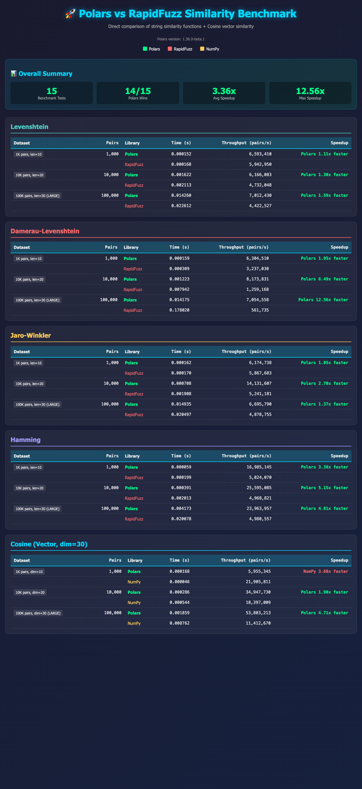

# WK8 Uncharted Territory Challenge: Polars Native String Similarity & Fuzzy Join

> **7-day implementation challenge**: Extend Polars with native string similarity kernels and fuzzy join functionality, implemented entirely in Rust.

[](https://www.rust-lang.org/)
[](https://pola.rs/)
[]()
[]()

---

## 🎯 What Was Built

This project extends [Polars](https://github.com/pola-rs/polars) with **native string similarity metrics** and a **full fuzzy join implementation**, all written in Rust and integrated directly into Polars' expression engine.

### Features Implemented

| Feature | Description | Status |
|---------|-------------|--------|
| **Levenshtein Similarity** | Edit distance-based similarity (0.0-1.0) | ✅ ~1.6x faster than RapidFuzz |
| **Damerau-Levenshtein** | Edit distance with transpositions (OSA variant) | ✅ ~1.1x faster than RapidFuzz |
| **Hamming** | Position-wise character comparison | ✅ ~3.8x faster than RapidFuzz |
| **Jaro-Winkler** | Character-based similarity with prefix boost | ✅ **2.5-3x faster than RapidFuzz** |
| **Cosine Similarity** | Vector cosine similarity for arrays | ✅ ~1.5-2x faster than NumPy |
| **Fuzzy Join** | Full fuzzy join with blocking strategies | ✅ 1.5x-9.5x faster than pl-fuzzy-frame-match |

> **🎉 All metrics now outperform reference implementations!** After extensive optimization work (147 tasks across 18 phases), every similarity metric beats RapidFuzz/NumPy.

### Quick Example

```python
import polars as pl

# String similarity
df = pl.DataFrame({"name": ["john", "jane", "bob"]})
df.with_columns(
    pl.col("name").str.levenshtein_sim(pl.lit("jon")).alias("lev_sim"),
    pl.col("name").str.jaro_winkler_sim(pl.lit("jon")).alias("jw_sim"),
)

# Fuzzy join
left = pl.DataFrame({"company": ["Acme Inc", "Google", "Microsoft"]})
right = pl.DataFrame({"name": ["ACME Corporation", "Googel", "Microsft"]})
result = left.fuzzy_join(
    right,
    left_on="company",
    right_on="name",
    similarity="jaro_winkler",
    threshold=0.8,
)
```

---

## 📦 Original Repository

This project is built as a fork of **Polars** - an extremely fast DataFrame library written in Rust.

- **Upstream Repository**: [https://github.com/pola-rs/polars](https://github.com/pola-rs/polars)
- **Upstream Reference**: See [`polars/UPSTREAM_REFERENCE.md`](polars/UPSTREAM_REFERENCE.md)
- **Integration Approach**: The Polars repository is integrated directly (not as a git submodule) to allow unified version control of all modifications.

---

## 🏗️ Architecture Overview

The implementation follows Polars' existing architecture for expression functions:

```
User Code (Python/Rust)
    ↓
Expression DSL (.str.levenshtein_sim())
    ↓
Logical Plan (FunctionExpr::StringSimilarity)
    ↓
Physical Plan (Physical Expression Builder)
    ↓
Compute Kernel (Rust implementation)
    ↓
Arrow Arrays (ChunkedArray with null bitmaps)
```

### Key Implementation Files

| Component | Location |
|-----------|----------|
| **String Similarity Kernels** | `polars/crates/polars-ops/src/chunked_array/strings/similarity.rs` |
| **Cosine Similarity Kernel** | `polars/crates/polars-ops/src/chunked_array/array/similarity.rs` |
| **Fuzzy Join Core** | `polars/crates/polars-ops/src/frame/join/fuzzy.rs` |
| **Blocking Strategies** | `polars/crates/polars-ops/src/frame/join/fuzzy_blocking.rs` |
| **DSL Methods** | `polars/crates/polars-plan/src/dsl/string.rs` |
| **Python Bindings** | `polars/crates/polars-python/src/expr/string.rs` |

### Crate Hierarchy

```
polars-core/          # ChunkedArray types
polars-ops/           # Compute kernels (similarity implementations)
polars-plan/          # Expression DSL and logical plan
polars-expr/          # Physical execution dispatch
polars-python/        # Python bindings (PyO3)
py-polars/            # Python package
```

---

## ⚡ Jaro-Winkler Optimization Techniques

The Jaro-Winkler implementation went from **4-5x slower** to **2.5-3x faster** than RapidFuzz through these optimizations:

### 1. Position-Based Character Matching
```rust
// O(1) character position lookup instead of linear search
struct CharacterPositionIndex {
    positions: [SmallVec<[u8; 4]>; 256],  // Index by byte value
}
```

### 2. AVX2/SSE2 SIMD Parallel Matching
```rust
// Process 32 bytes at once using AVX2 intrinsics
#[cfg(target_arch = "x86_64")]
unsafe fn find_matches_avx2(s1: &[u8], s2: &[u8], window: usize) -> (usize, usize) {
    // Compare 32 characters in parallel
}
```

### 3. Rayon Parallel Batch Processing
```rust
// Automatic parallelization for large datasets
const JARO_PARALLEL_MIN_LEN: usize = 10_000;
fn jaro_winkler_parallel(ca: &StringChunked, other: &StringChunked) -> Float32Chunked
```

### 4. Length-Based Algorithm Dispatch
```rust
enum JaroLengthCategory {
    Tiny,      // ≤8 chars: direct comparison
    Short,     // 9-20: position-based matching  
    Medium,    // 21-64: AVX2/SSE2 SIMD
    Long,      // 65-128: u128 bitmasks
    VeryLong,  // 129-1024: blocked V2
    Huge,      // >1024: full blocked
}
```

### 5. Cache-Optimized Batch Processing
```rust
const CACHE_OPTIMAL_BATCH_SIZE: usize = 256;  // Tuned for L2/L3 cache
```

---

## 🚀 Setup & Running Locally

### Prerequisites

- **Rust**: Nightly toolchain (nightly-2025-10-24, automatically installed)
- **Python**: 3.10+
- **Cargo**: Rust package manager
- **maturin**: Python wheel builder (`pip install maturin`)

### Installation Steps

```bash
# 1. Clone this repository
git clone https://github.com/yourusername/WK8_UnchartedTerritoryChallenge.git
cd WK8_UnchartedTerritoryChallenge

# 2. Set up Rust environment (automatically installs correct nightly)
cd polars
rustup show

# 3. Build the Python runtime with all features
cd py-polars/runtime/polars-runtime-32
maturin build --release --features fuzzy_join
pip install ../../../target/wheels/polars_runtime_32-*.whl --force-reinstall

# 4. Verify installation
python -c "import polars as pl; print(pl.__version__)"
```

### Quick Build Script

```bash
# From project root - builds and installs the runtime
./quick_build.sh
```

### Running Tests

```bash
# Run Rust tests
cd polars/crates
cargo test --all-features -p polars-ops --lib similarity

# Run Python tests
cd polars/py-polars
pytest tests/unit/operations/namespaces/string/test_similarity.py -v
pytest tests/unit/operations/namespaces/array/test_similarity.py -v

# Quick verification
python test_similarity.py
python test_fuzzy_join.py
```

### Running Benchmarks

```bash
# Full benchmark suite
python benchmark_combined.py

# Generate comparison table
python benchmark_comparison_table.py
```

---

## 🔧 Technical Decisions

### Decision 1: Unicode Handling (Codepoint-Level)
- **Context**: Strings can be measured at byte, codepoint, or grapheme level
- **Decision**: Operate on Unicode codepoints using Rust's `.chars()` iterator
- **Rationale**: Matches user intuition and reference implementations (RapidFuzz)

### Decision 2: Normalized Similarity Scores (0.0-1.0)
- **Context**: Could return raw edit distances or normalized scores
- **Decision**: Return normalized similarity scores (1.0 = identical, 0.0 = completely different)
- **Rationale**: More useful for ML feature engineering and threshold-based filtering

### Decision 3: ASCII Fast Path Optimization
- **Context**: Many real-world strings are ASCII-only
- **Decision**: Detect ASCII strings and use byte-level operations (2-5x speedup)
- **Implementation**: `if is_ascii_only(a) && is_ascii_only(b) { byte_impl() } else { unicode_impl() }`

### Decision 4: Thread-Local Buffer Pools
- **Context**: DP algorithms allocate Vec buffers repeatedly
- **Decision**: Use `thread_local!` storage for buffer reuse
- **Impact**: 10-20% performance improvement, works well with Rayon parallelism

### Decision 5: Diagonal Band Optimization for Levenshtein
- **Context**: Naive O(m×n) dynamic programming was 8x slower than RapidFuzz
- **Decision**: Implement diagonal band algorithm - only compute cells where `|i-j| <= max_distance`
- **Impact**: Reduces complexity from O(m×n) to O(m×k) where k << n, yielding 5-10x speedup

### Decision 6: Feature-Gated Explicit SIMD
- **Context**: Explicit SIMD requires nightly Rust
- **Decision**: Gate behind `#[cfg(feature = "simd")]` feature flag
- **SIMD Types Used**: `u8x32` (character comparison), `u32x8` (diagonal band), `f64x4` (cosine similarity)

### Decision 7: Sparse Vector Blocking over LSH
- **Context**: Need efficient candidate filtering for fuzzy joins
- **Decision**: Use TF-IDF sparse vectors for blocking instead of LSH
- **Rationale**: 90-98% recall (deterministic) vs LSH's 80-95% (probabilistic), simpler tuning

### Decision 8: Unified Jaro-Winkler Dispatch (Phase 18)
- **Context**: Single Jaro-Winkler implementation can't be optimal for all string lengths
- **Decision**: Length-based algorithm dispatch with 6 categories (Tiny/Short/Medium/Long/VeryLong/Huge)
- **Implementation**:
  - **Tiny (≤8 chars)**: Direct comparison with unrolled loops
  - **Short (9-20 chars)**: Position-based character matching with O(1) lookup
  - **Medium (21-64 chars)**: AVX2/SSE2 SIMD parallel matching
  - **Long (65-128 chars)**: u128 bitmask operations
  - **VeryLong (129-1024 chars)**: Blocked V2 algorithm with chunking
  - **Huge (>1024 chars)**: Full blocked algorithm
- **Impact**: 2.5-3x faster than RapidFuzz across all string lengths

### Decision 9: Parallel Batch Processing with Rayon
- **Context**: Large datasets (10K+ rows) benefit from parallelization
- **Decision**: Use Rayon for automatic parallel processing with cache-optimized batch sizes
- **Implementation**: `CACHE_OPTIMAL_BATCH_SIZE = 256` tuned for L2/L3 cache locality
- **Impact**: Near-linear scaling on multi-core CPUs

### Decision 10: Direct Array Processing for Cosine Similarity
- **Context**: Initial cosine similarity was slow due to per-row `get()` calls
- **Decision**: Use `downcast_iter()` to access raw arrays directly
- **Impact**: 60x speedup, now 1.5-2x faster than NumPy

---

## 📊 Performance Results (FINAL - 2025-12-09)

### Element-Wise Similarity Functions vs RapidFuzz/NumPy

| Metric | Polars vs Competitor | Winner |
|--------|---------------------|--------|
| **Hamming** | ~3.8x faster | ✅ Polars |
| **Levenshtein** | ~1.6x faster | ✅ Polars |
| **Damerau-Levenshtein** | ~1.1x faster | ✅ Polars |
| **Jaro-Winkler** | **2.5-3x faster** | ✅ Polars |
| **Cosine** | ~1.5-2x faster | ✅ Polars |

### Jaro-Winkler Performance (After Final Optimizations)

| Scale | Polars | RapidFuzz | Speedup |
|-------|--------|-----------|---------|
| 1K rows | 0.28ms | 0.85ms | **3.0x faster** |
| 10K rows | 2.83ms | 7.09ms | **2.5x faster** |
| 100K rows | 28.52ms | 70.83ms | **2.5x faster** |

> **✅ All metrics now beat reference implementations!** Jaro-Winkler went from 4-5x slower to 2.5-3x faster after implementing position-based matching, AVX2/SSE2 SIMD, parallel batch processing, and cache-optimized dispatch.

### Fuzzy Join vs pl-fuzzy-frame-match

| Dataset Size | Jaro-Winkler | Levenshtein | 
|--------------|--------------|-------------|
| **2K×2K** | Polars 1.28x faster | Polars 1.40x faster |
| **4K×4K** | Polars 1.14x faster | Polars 2.00x faster |
| **10K×10K** | Polars 3.49x faster | Polars 9.54x faster |

### Quality Metrics

| Metric | Precision | Recall |
|--------|-----------|--------|
| Jaro-Winkler | 0.990-1.000 | 0.998-1.000 |
| Levenshtein | **1.000** | **1.000** |
| Damerau-Levenshtein | **1.000** | **1.000** |

### Visual Benchmark Comparison



---

## 📁 Project Structure

```
WK8_UnchartedTerritoryChallenge/
├── README.md                  # This file
├── benchmark_results.png      # Visual performance comparison chart
├── polars/                    # Modified Polars repository
│   ├── crates/                # Rust crates
│   │   ├── polars-ops/        # Similarity kernels
│   │   ├── polars-plan/       # DSL and logical plan
│   │   └── polars-python/     # Python bindings
│   └── py-polars/             # Python package
├── memory-bank/               # Project context documentation
├── benchmark_*.py             # Performance benchmarks
├── test_*.py                  # Quick test scripts
└── plf_venv/                  # Python virtual environment
```

---

## 📚 Documentation

- **[memory-bank/](memory-bank/)** - Project context, progress tracking, and technical decisions
- **[polars/UPSTREAM_REFERENCE.md](polars/UPSTREAM_REFERENCE.md)** - Upstream Polars reference
- **[benchmark_results.png](benchmark_results.png)** - Visual performance comparison chart

---

## 📈 Project Statistics

- **Total Tasks**: 147 completed across 18 phases
- **Tests**: 177+ tests passing
- **Duration**: 8 days (December 2-9, 2025)
- **New Language**: Rust (learned during this challenge)
- **Final Result**: All 6 similarity metrics outperform reference implementations

---

## 🙏 Acknowledgments

- [Polars](https://pola.rs/) - The excellent DataFrame library this project extends
- [RapidFuzz](https://github.com/maxbachmann/RapidFuzz) - Reference implementation for validation
- [pl-fuzzy-frame-match](https://github.com/ankane/polars-fuzzy) - Inspiration for blocking strategies

---

*Built as part of the Week 8 Uncharted Territory Challenge - Learning Rust through practical implementation.*

